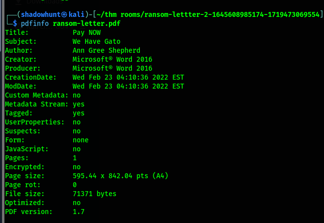

# Digital Forensics Fundamentals(THM)

## Digital Forensics Methodology

NIST introduces the process of digital forensics in four phases

1. Collection: It is the first phase of digital forensics where the most important task is done which is data collection.  Usually, an investigator can find personal computers, laptops, digital cameras, USBs, etc., on the crime scene.
2. Examination: The collected data may be overwhelm investigators due to its size. So this data needs to be filtered and the data of interest needs to be extracted.
3. Analysis: In this critical phase investigators now have to analyze the data by correlating it with multiple pieces of evidence to draw conclusions. The analysis aims to extract the activities relevant to the case chronologically.
4. Reporting: In the last phase of digital forensics, a detailed report is prepared. This report contains the investigation’s methodology and detailed findings from the collected evidence. It may also contain recommendations. This report is presented to law enforcement and executive management. It is important to include executive summaries as part of the report, considering the level of understanding of all the receiving parties.

## Some  most common types of forensics

- Computer forensics
- Mobile forensics
- Network forensics
- Database forensics
- Cloud forensics
- Email forensics

## Evidence  Acquisition

1. **Proper  Authorization:**  The forensics team should obtain authorization from the relevant authorities before collecting any data. Evidence collected without prior approval may be deemed inadmissible in court.  ****
2. **Chain of Custody:** Imagine that a team of investigators collects all the evidence from the crime scene, and some of the evidence goes missing after a few days, or there is any change in the evidence. No individual can be held accountable in this scenario because there is no proper process for documenting the evidence owners. This problem can be solved by maintaining a chain of custody document. A chain of custody is a formal document containing all the details of the evidence. 

Key details include:

- Description of the evidence (name, type).
- Names of the individuals who collected the evidence.
- Date and time of evidence collection.
- Storage location of each piece of evidence.
- Access times and the individual who accessed the evidence.
1. **Use of write blockers:** Write blockers are an essential part of the digital forensics team’s toolbox. Suppose you are collecting evidence from a suspect’s hard drive and attaching the hard drive to the forensic workstation. While the collection occurs, some background tasks in the forensic workstation may alter the timestamps of the files on the hard drive. This can cause hindrances during the analysis, ultimately producing incorrect results. Suppose the data was collected from the hard drive using a write blocker instead, in the same scenario. This time, the suspect’s hard drive would remain in its original state as the write blocker can block any evidence alteration actions.

## Windows Forensics

Two different categories of forensic images are taken from a Windows operating system: Disk image(SSD, HDD, etc.), Memory image(RAM).

There are some popular tools used for disk images of Windows operating systems.

- FTK Imager: It is a widely used tool for taking disk images of Windows operating systems. It offers a user-friendly graphical interface for creating the image in various formats.
- Autospy: An investigator can import an acquired disk image into this tool, and the tool will conduct an extensive analysis of the image. It offers various features during image analysis, including keyword search, deleted file recovery, file metadata, extension mismatch detection, and many more.
- Dumplit: This tool creates memory images using a command-line interface and a few commands. The memory image can also be taken in different formats.
- Volatility: It is a powerful open source for analyzing memory images, and it offers some extremely useful plugins. This tool supports various operating systems.

## Practical example of digital forensics

Here is the problem. 

Our cat, Gado, has been kidnapped. The kidnapper has sent us a document containing their requests in MS Word format. We have converted the document to PDF and extracted the image from the Word file for your convenience.

We need to find the location and author name also the camera model which is used to take the photo.

Firstly, I used the PDFInfo tool to find out the author’s name from the PDF file.

Here you can see clearly the author Ann Gree Shepherd.

Then my next task is to find the street location from the image. So I used the exiftool and searched for the GPS position of the image.

I searched this location in the google maps and found out the street whose name was Milk Street.

Now my last task is to find out the device name that is used to capture the image. So I again used the exiftool command, now more specifically the grep command, so that it can only show me the camera model name output.

What I have learned from this lab is that when we create a text file, some metadata gets saved by the os. such as file creation date and last modification date. However, much information gets kept within the file’s metadata when we use a more advanced editor such as MS Word. Exporting the file to other formats, such as PDF, would maintain most of the metadata of the original document, depending on the PDF writer used.
We can use PDFinfo tools to get such information from a PDF file. Another thing is EXIF, which stands for Exchangeable Image File Format. It is a standard for saving metadata to image files. Whenever we take a photo with our smartphone or with our digital camera, plenty of information gets embedded in the image. There are many online and offline tools to read the EXIF data from images. One command-line tool is exiftool. ExifTool is used to read and write metadata in various file types, such as JPEG images.