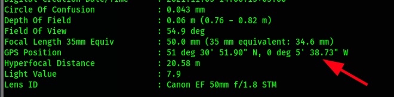
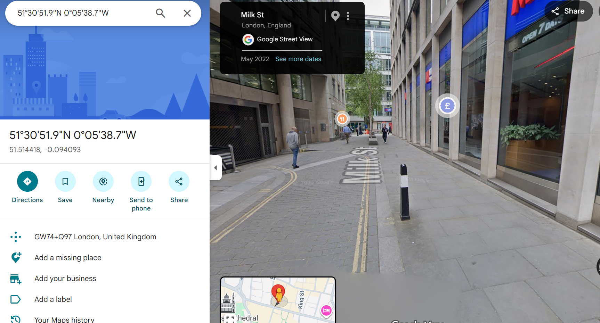
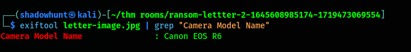

# Digital Forensics Fundamentals (TryHackMe)

This write-up summarizes the TryHackMe **Digital Forensics Fundamentals** room. The room introduces the digital forensics process, common investigation domains, evidence acquisition principles, and a short practical exercise involving metadata extraction from PDF and image files.

> This document is for educational use and is based on an authorized TryHackMe lab environment.

## Table of Contents

- [Digital Forensics Methodology](#digital-forensics-methodology)
- [Common Types of Forensics](#common-types-of-forensics)
- [Evidence Acquisition](#evidence-acquisition)
- [Windows Forensics](#windows-forensics)
- [Practical Investigation Scenario](#practical-investigation-scenario)
- [Finding the PDF Author](#finding-the-pdf-author)
- [Extracting GPS Metadata](#extracting-gps-metadata)
- [Identifying the Street Location](#identifying-the-street-location)
- [Identifying the Camera Model](#identifying-the-camera-model)
- [Key Takeaways](#key-takeaways)

## Digital Forensics Methodology

NIST describes the digital forensics process in four main phases:

| Phase | Purpose |
| --- | --- |
| Collection | Collect evidence from relevant sources such as computers, laptops, digital cameras, USB drives, and other digital devices. |
| Examination | Filter and extract useful data from the collected evidence. This step helps investigators manage large volumes of information. |
| Analysis | Correlate evidence, reconstruct activity, and draw conclusions from the recovered data. |
| Reporting | Prepare a formal report that documents the methodology, findings, and recommendations. The report may be used by law enforcement, technical teams, or executive management. |

## Common Types of Forensics

Digital forensics can cover many areas, including:

- Computer forensics
- Mobile forensics
- Network forensics
- Database forensics
- Cloud forensics
- Email forensics

Each discipline focuses on a different source of evidence, but the overall goal remains the same: preserve, examine, analyze, and report on digital artifacts in a reliable way.

## Evidence Acquisition

Evidence acquisition is one of the most important parts of a forensic investigation. If evidence is collected incorrectly, it may become unreliable or inadmissible.

### Proper Authorization

The forensic team should obtain authorization from the relevant authority before collecting data. Evidence collected without permission may not be usable in a formal investigation.

### Chain of Custody

A chain of custody is a formal record that documents how evidence was collected, stored, transferred, and accessed. It helps prove that evidence was handled properly and was not altered.

Important chain-of-custody details include:

- Description of the evidence
- Name of the person who collected it
- Date and time of collection
- Storage location
- Access history
- Names of people who accessed or transferred the evidence

### Write Blockers

Write blockers help prevent accidental modification of evidence. For example, connecting a suspect drive directly to a forensic workstation could alter timestamps or metadata. A write blocker helps preserve the original state of the evidence by preventing write operations.

## Windows Forensics

Forensic images from Windows systems generally fall into two categories:

| Image Type | Description |
| --- | --- |
| Disk image | A copy of storage media such as an HDD or SSD. |
| Memory image | A capture of volatile memory, such as RAM. |

Common tools include:

| Tool | Use Case |
| --- | --- |
| FTK Imager | Creates forensic disk images through a graphical interface. |
| Autopsy | Analyzes disk images and supports keyword search, deleted file recovery, metadata review, and file mismatch detection. |
| DumpIt | Captures memory images from a Windows system. |
| Volatility | Analyzes memory images using plugins across multiple operating systems. |

## Practical Investigation Scenario

The practical task presented a scenario involving a kidnapped cat named Gado. The kidnapper sent a Microsoft Word document containing demands. A PDF version of the document and an extracted image were provided for analysis.

The investigation goals were:

1. Identify the author of the document.
2. Determine the street location from the image metadata.
3. Identify the camera model used to capture the photo.

## Finding the PDF Author

The first task was to inspect the PDF metadata using `pdfinfo`.


The metadata revealed the author name:

```text
Ann Gree Shepherd
```

This demonstrates why document metadata matters during forensic analysis. Files exported from document editors can retain author names, timestamps, software details, and other useful investigative artifacts.

## Extracting GPS Metadata

Next, I inspected the extracted image with `exiftool` to identify GPS metadata.



The GPS position from the image metadata provided coordinates that could be searched on a map.

## Identifying the Street Location

After checking the GPS coordinates in Google Maps, the location was identified as **Milk Street**.



This step shows how EXIF GPS data can connect a digital image to a physical location.

## Identifying the Camera Model

Finally, I used `exiftool` again and filtered the output to identify the camera model used to capture the image.



Image metadata can include details such as device manufacturer, camera model, capture time, GPS coordinates, and software used to process the file.

## Key Takeaways

This room demonstrated how metadata can support a forensic investigation:

- PDF files can preserve document metadata such as the author name.
- Image files may contain EXIF data, including GPS coordinates and camera details.
- `pdfinfo` is useful for inspecting PDF metadata.
- `exiftool` is useful for reading metadata from images and many other file types.
- Forensic work depends on careful evidence handling, documentation, and preservation.

Digital forensics is not only about recovering files. It is about preserving evidence, extracting reliable artifacts, correlating those artifacts, and presenting findings clearly.
