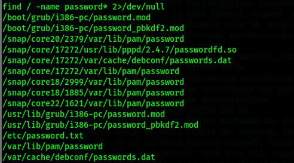
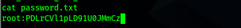
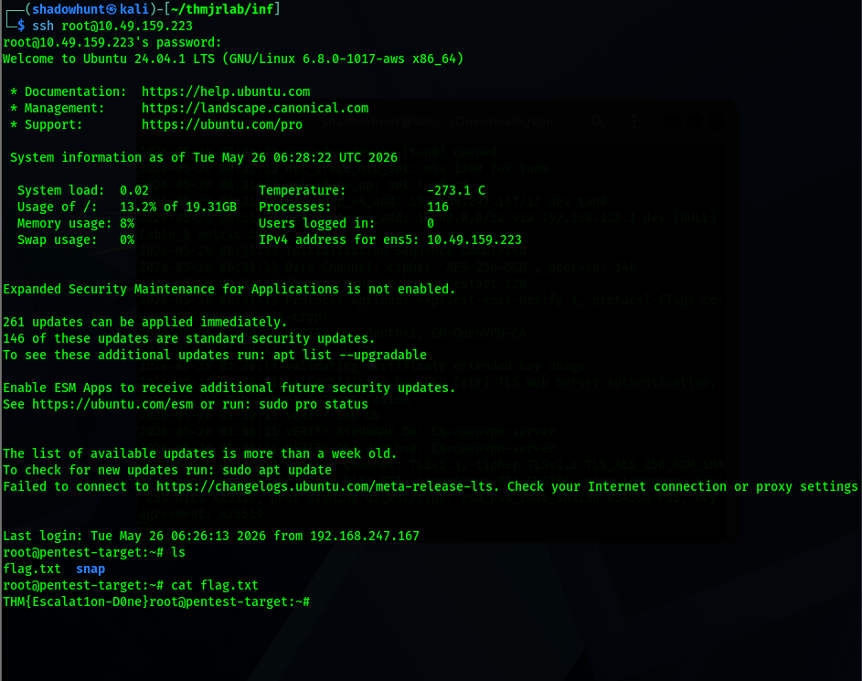
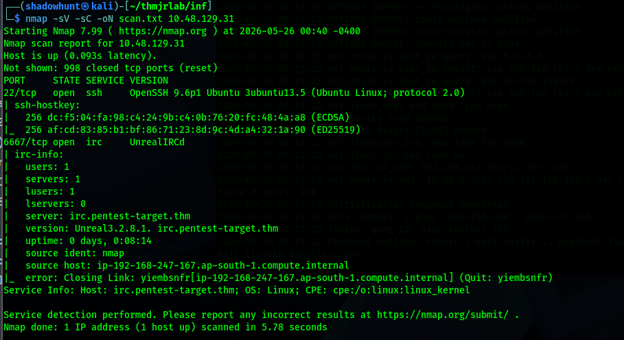
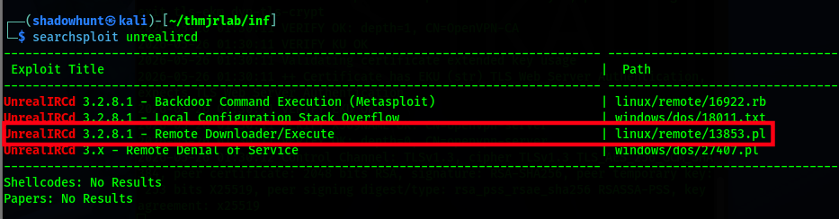
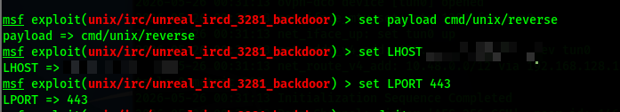
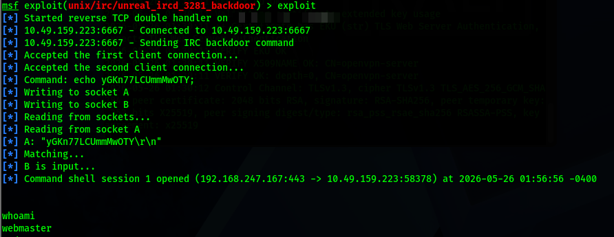

# Guided Pentest: Infrastructure - Penetration Test Report

**Prepared by:** Asif Bin Mahmood  
**Platform:** TryHackMe  
**Room:** Guided Pentest: Infrastructure  
**Report Version:** 1.0  
**Date:** 2026-05-26

## Executive Summary

A guided infrastructure penetration test was completed against the target machine. The assessment identified an exploitable UnrealIRCd service that allowed initial remote command execution. After gaining a low-privileged shell, a plaintext root password was discovered on the filesystem. This password allowed direct SSH access as root, resulting in full compromise of the target.

The most serious issue was the storage of the root password in plaintext. Once any attacker gained basic shell access, this file made privilege escalation straightforward and led directly to complete system compromise.

## Technical Summary

The target exposed two primary services during enumeration, including SSH and UnrealIRCd. Version and vulnerability research showed that the UnrealIRCd service was affected by a known command execution vulnerability. Metasploit was used to exploit the service and obtain a shell as the `webmaster` user.

Post-exploitation enumeration found `/etc/password.txt`, which contained the root password in plaintext. Because SSH was available, the recovered credential was used to authenticate as root and retrieve the final flag.

## Vulnerability Summary

| Severity | Finding | Impact |
| --- | --- | --- |
| Critical | Root Password Stored in Plaintext | Full system compromise through credential disclosure and root SSH login |
| High | Vulnerable UnrealIRCd Service | Remote command execution and initial shell access |

## Detailed Findings

### Finding 1: Root Password Stored in Plaintext

**Severity:** Critical

**Description:**  
The root user's password was stored in plaintext in `/etc/password.txt`. After obtaining a low-privileged shell, this file was discoverable and readable. The exposed password allowed authentication as root over SSH.

**Impact:**  
An attacker with low-privileged shell access could recover the root password and gain complete administrative control of the machine. This includes access to all files, services, credentials, and flags.

**Evidence:**







**Exploitation Steps:**

1. Obtain a shell as a low-privileged user.
2. Search for password-related files:

   ```bash
   find / -name "password*" 2>/dev/null
   ```

3. Locate `/etc/password.txt`.
4. Read the file and recover the root password.
5. Authenticate over SSH as root:

   ```bash
   ssh root@10.49.159.223
   ```

**Recommendation:**  
Remove `/etc/password.txt` immediately and rotate the root password. Do not store credentials in plaintext on the filesystem. Use proper system authentication storage such as `/etc/shadow` with strong hashing. Restrict file permissions and apply least privilege so low-privileged users cannot read sensitive files.

### Finding 2: Vulnerable UnrealIRCd Service

**Severity:** High

**Description:**  
Enumeration identified an UnrealIRCd service. Vulnerability research using SearchSploit showed a known exploit path for UnrealIRCd. Metasploit was used to exploit the vulnerable service and open a shell as `webmaster`.

**Impact:**  
The vulnerable service allowed initial access to the system. While this access was not root by itself, it created the foothold needed to enumerate the filesystem and discover the plaintext root password.

**Evidence:**









**Exploitation Steps:**

1. Enumerate services with Nmap:

   ```bash
   nmap -sV -sC -oN scan.txt 10.48.129.31
   ```

2. Search for known UnrealIRCd exploits:

   ```bash
   searchsploit unrealircd
   ```

3. Open Metasploit and select the relevant UnrealIRCd exploit module.
4. Configure `RHOSTS`, `LHOST`, `LPORT`, and the payload.
5. Run the exploit and confirm shell access as `webmaster`.

**Recommendation:**  
Upgrade or remove the vulnerable UnrealIRCd service. If the service is required, run a supported version, restrict network exposure, and monitor for suspicious connections. Apply regular vulnerability management so outdated services are found and remediated before exploitation.

## Attack Path

1. Nmap identified open services on the target.
2. UnrealIRCd was selected for vulnerability analysis.
3. SearchSploit showed a known exploit for UnrealIRCd.
4. Metasploit exploited the service and opened a shell as `webmaster`.
5. The user flag was retrieved from the `webmaster` user's files.
6. Filesystem enumeration discovered `/etc/password.txt`.
7. The plaintext root password was recovered.
8. SSH was used to log in as root.
9. The final flag was retrieved.

## Conclusion

The infrastructure target was fully compromised through a chain of weaknesses: an exploitable UnrealIRCd service provided initial access, and plaintext root credential storage allowed privilege escalation. Removing exposed credentials, patching vulnerable services, and enforcing proper file permissions would significantly reduce the risk of this attack path.
