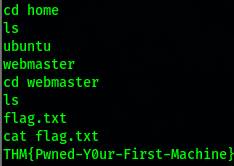

# Guided Pentest: Infrastructure

TryHackMe room: **Guided Pentest: Infrastructure**

This room walks through a realistic infrastructure penetration test flow:

1. Enumeration
2. Vulnerability analysis
3. Initial access
4. Privilege escalation
5. Reporting

## 1. Enumeration

Before exploiting anything, the first goal is to understand the target. Enumeration helps identify open ports, running services, software versions, and possible attack paths.

I started with an Nmap service and default script scan:

```bash
nmap -sV -sC -oN scan.txt 10.48.129.31
```

Command breakdown:

- `-sV`: Detects service and version information.
- `-sC`: Runs Nmap's default scripts.
- `-oN scan.txt`: Saves the output in normal format.


The scan showed two open services. At this stage, the key questions were:

- Is the service version outdated?
- Is there a known exploit for this version?
- Is the service misconfigured?

## 2. Vulnerability Analysis

Vulnerability analysis means taking the enumeration results and asking: **what can go wrong here?**

The target was running UnrealIRCd, so I searched for known exploits using SearchSploit:

```bash
searchsploit unrealircd
```


SearchSploit showed a known UnrealIRCd backdoor command execution vulnerability. This made UnrealIRCd the best initial attack path.

## 3. Initial Access

Metasploit can simplify exploitation by providing ready-made exploit modules, payloads, listeners, and session handlers.

Without Metasploit, the process would involve finding exploit code, modifying IP addresses and ports, creating or selecting a payload, starting a listener, and manually handling the shell.

With Metasploit, the process became:

1. Start `msfconsole`.
2. Search for the UnrealIRCd exploit.
3. Select the matching exploit module.
4. Set `RHOSTS`, `LHOST`, `LPORT`, and the payload.
5. Run the exploit.


After running the exploit, a shell session opened successfully. I confirmed command execution and identified the current user as `webmaster`.


## 4. User Flag

After gaining a shell as `webmaster`, I moved through the home directory, located the `webmaster` user's files, and retrieved the user flag.



## 5. Privilege Escalation

The next goal was to escalate from the low-privileged `webmaster` user to `root`.

I searched the filesystem for password-related files:

```bash
find / -name "password*" 2>/dev/null
```

The `2>/dev/null` part redirects permission errors away from the terminal so the useful results are easier to read.


The search revealed a plaintext password file at:

```text
/etc/password.txt
```

I opened the file and found the root password.


Since SSH was open from the original Nmap scan, I used the discovered root password to log in as `root` over SSH:

```bash
ssh root@10.49.159.223
```

After logging in as root, I accessed the final flag.


## Attack Chain Summary

1. **Enumeration:** Nmap identified open services, including SSH and UnrealIRCd.
2. **Vulnerability Analysis:** SearchSploit revealed a known UnrealIRCd vulnerability.
3. **Initial Access:** Metasploit exploited UnrealIRCd and opened a shell as `webmaster`.
4. **User Access:** The user flag was retrieved from the `webmaster` account.
5. **Privilege Escalation:** A plaintext root password was discovered in `/etc/password.txt`.
6. **Root Access:** SSH access as `root` was achieved using the discovered password.

## Key Finding

### Root Password Stored in Plaintext

**Severity:** Critical

The root user's password was stored in plaintext inside `/etc/password.txt`. This file was readable after gaining a low-privileged shell, allowing the attacker to recover root credentials and fully compromise the machine.

**Impact:**

- Full system compromise.
- Direct root SSH access.
- Complete access to sensitive files and flags.

**Recommendation:**

Remove the plaintext password file immediately and rotate the root password. Credentials should never be stored in plaintext on the filesystem. Use proper system authentication mechanisms such as `/etc/shadow` with strong hashing, restrict sensitive file permissions, and follow the principle of least privilege.

## Report Writing Guideline

A penetration test report should include:

- A cover page with a title, tester name, email address, and version control.
- A table of contents, if the report is long enough to need one.
- An executive summary for the manager who requested the engagement, written in non-technical language.
- A technical summary for engineering leadership, explaining impact and remediation priority.
- A vulnerability table ordered by severity.
- A detailed exploitation section for each vulnerability, including impact, exploitation steps, proof, and recommendations.

The report is where the tester communicates the value of the work. It should be clear, detailed, and useful for the people who need to understand and fix the issues.

### Example Finding Format

**Title:** Root Password Stored in Plaintext

**Severity:** Critical

**Description:** The root user's password was found stored in plaintext within `/etc/password.txt`. This file was readable by low-privileged users, allowing any user with shell access to retrieve root credentials and fully compromise the system.

**Exploitation Steps:**

1. Obtain a low-privileged shell on the target system.
2. Read `/etc/password.txt`.
3. Use the discovered root password to escalate privileges via SSH.

**Recommendation:** Remove the plaintext password file immediately and rotate the root password. Credentials should never be stored in plaintext. Implement a secrets management solution or use properly configured system authentication mechanisms. Restrict file permissions and enforce least privilege.
